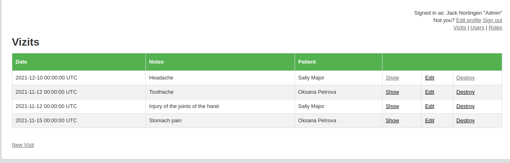
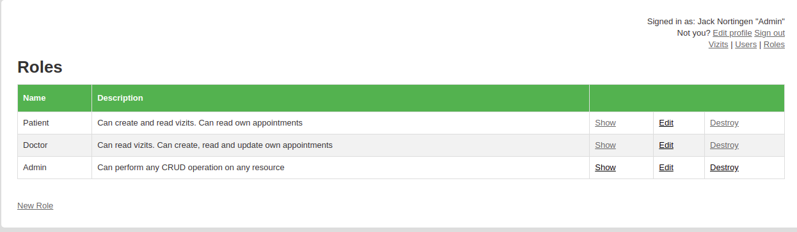

# README

There are three main models in this project:
* `User` - can create an account, log in to the account using a mobile phone number and password, log out of the account.
* `Role`-
- `Admin` - Can perform any CRUD operation on any resource,
- `Patient` - Can create and read visits. Can read own appointments, 
- `Doctor` - Can read visits. Can create, read and update own appointments
* `Visit` - planned as a record of the patient for an appointment with a doctor (Model `Appointment`, as a result of the interaction of the `Patient` and the `Doctor`, will be created later)
* gem `devise` used for user authentication
* gem `cancancan` for user authorization
- The pages provide different interfaces and access rights for users with different roles
- Added several navigation links to the title according to the administrator's access rights

* Ruby version - `2.7.2`
- Rails version - `6.1.4.1`
- Postgres: >=9.5

* Clone this repo
- `https://github.com/Laguna1/Model-with-roles-2`
- `cd Model-with-roles-2` 

* System dependencies
- `bundle install`
* Configuration

* Database creation
- `rails db:create`

* Database initialization
- `rails db:migrate`

* Start server
- `rails s`
- Open `http://localhost:3000/` in your browser

- `rails c` Creating the first visit:
- `v=Visit.create!(note: 'Headache', pat_id: 1, doc_id: 4)`
- `Visit.all` or Visit.all.count
- `v.pat` or v.pat.fullname
- `v.doc` or v.doc.fullname
- `User.first.created_visits`
- `User.first.created_visits.first.doc.fullname`
- `User.first.created_visits.first.doc.category.speciality`
- `User.fourth.requested_visits.first.pat.fullname`
- `User.fourth.requested_visits.first.note`

### Author

👤 **Oksana Petrova**

- GitHub: [@github/Laguna1](https://github.com/Laguna1)
- Linkedin: [linkedin/OksanaPetrova](https://www.linkedin.com/in/oksana-petrova/)
- Twitter: [@OksanaP48303303](https://twitter.com/OksanaP48303303)

## 🤝 Contributing

Contributions, issues and feature requests are welcome!

Feel free to check the [issues page](https://github.com/Laguna1/Model-with-roles-2/issues).

## Show your support

Give a ⭐️ if you like this project!